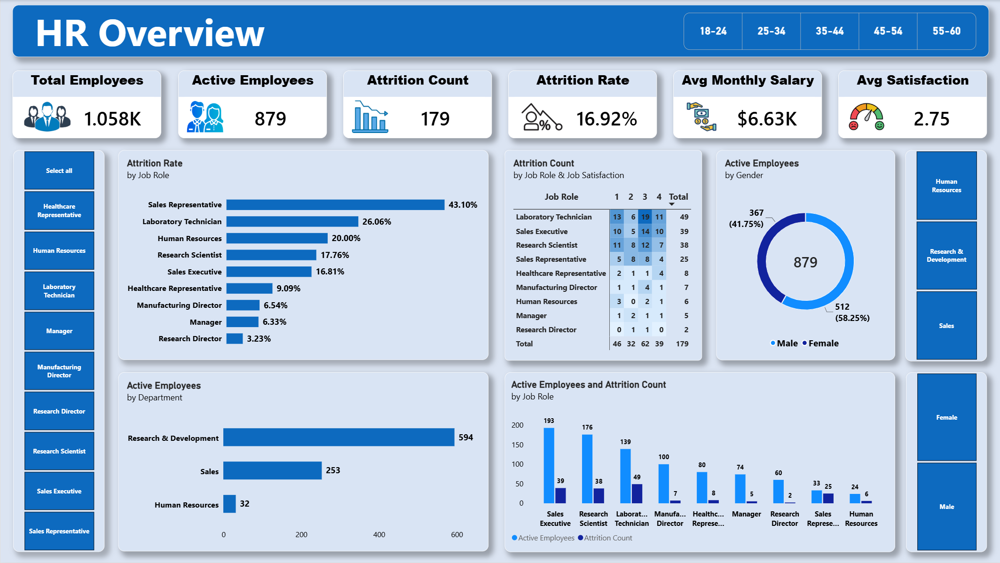

# HR Analytics Dashboard -- Employee Performance & Attrition

## Project Overview

This project is an interactive **HR Analytics Dashboard** built using
**Microsoft Power BI** to analyze employee attrition, workforce
distribution, job satisfaction, performance, compensation, overtime,
training, and work-life balance.

The dashboard consists of two pages that provide both a high-level HR
overview and a deeper analysis of employee performance and satisfaction.

------------------------------------------------------------------------

## Business Objective

The objective of this project is to use HR data to identify workforce
trends and answer key business questions such as:

-   What is the overall employee attrition rate?
-   Which job roles have the highest attrition?
-   Which departments have the highest number of active employees?
-   How is overtime associated with employee attrition?
-   How does job level relate to employee income?
-   What are the overall levels of employee satisfaction and
    performance?
-   Which job roles contribute the most to total attrition?
-   How do work-life balance and employee satisfaction compare across
    the workforce?

------------------------------------------------------------------------

## Dashboard Pages

### 1. HR Overview

The **HR Overview** page provides a high-level view of the
organization's workforce, attrition, compensation, and employee
satisfaction.

#### Key KPIs

-   **Total Employees:** 1,058
-   **Active Employees:** 879
-   **Attrition Count:** 179
-   **Attrition Rate:** 16.92%
-   **Average Monthly Salary:** \$6.63K
-   **Average Satisfaction:** 2.75

#### Visualizations

-   Attrition Rate by Job Role
-   Attrition Count by Job Role and Job Satisfaction
-   Active Employees by Gender
-   Active Employees by Department
-   Active Employees vs Attrition Count by Job Role

------------------------------------------------------------------------

### 2. Employee Performance & Satisfaction

The **Employee Performance & Satisfaction** page focuses on employee
performance, satisfaction, training, overtime, income, and work-life
balance.

#### Key KPIs

-   **Average Performance Rating:** 3.15
-   **Average Job Satisfaction:** 2.75
-   **Average Training Sessions:** 3
-   **Low-Satisfied Employees:** 400
-   **Employees Working Overtime:** 307
-   **Average Work-Life Balance:** 2.76

#### Visualizations

-   Total Employees by Department and Work-Life Balance
-   Employees Working Overtime by Job Role
-   Employees by Job Satisfaction
-   Average Monthly Income by Years at Company and Job Level
-   Employees by Department and Performance Rating
-   Attrition by Overtime

------------------------------------------------------------------------

## Key Insights

-   **Research & Development** has the highest number of active
    employees, with **594 employees**, followed by Sales with 253 and
    Human Resources with 32.

-   **Sales Representatives** have the highest attrition rate at
    **43.10%**, making it the job role with the highest attrition rate
    in the organization.

-   **Laboratory Technicians, Sales Executives, Research Scientists, and
    Sales Representatives** account for **151 of the 179 total
    attritions**, representing approximately **84.36%** of all
    attrition. This indicates that attrition is highly concentrated
    among these four job roles.

-   **Research Directors (3.23%), Managers (6.33%), and Manufacturing
    Directors (6.54%)** have the lowest attrition rates among the job
    roles analyzed.

-   Employees working overtime have an attrition rate of **31.92%**,
    compared with **10.79%** among employees who do not work overtime.
    This indicates a strong association between overtime and employee
    attrition.

-   **Research Scientists, Sales Executives, and Laboratory
    Technicians** have the highest numbers of employees working overtime
    and are also among the roles with higher attrition rates. This
    suggests overtime may be an important factor to investigate further,
    although this analysis does not establish overtime as a direct cause
    of attrition.

-   Average monthly income generally increases with **job level**, while
    years at the company do not show a clear positive relationship with
    salary within the same job level. Employees with significantly
    different years of experience can have similar income levels.

-   Employee performance is concentrated around a rating of **3**, with
    an overall average performance rating of **3.15**. Average work-life
    balance is **2.76** and average job satisfaction is **2.75**,
    highlighting employee experience as an area for further
    investigation.

------------------------------------------------------------------------

## Business Recommendations

Based on the analysis:

-   Investigate the high attrition rate among **Sales Representatives**
    and identify potential contributing factors such as workload, job
    satisfaction, compensation, and career progression.

-   Review overtime patterns in **Research, Sales, and Laboratory**
    roles and evaluate whether workload distribution or staffing levels
    can be improved.

-   Analyze employees with low job satisfaction and examine their
    relationship with overtime, work-life balance, performance, and
    attrition.

-   Develop targeted retention strategies for the four job roles
    contributing the majority of total attrition.

-   Further investigate the relationship between **years at the company,
    job level, and compensation** to better understand career
    progression and salary growth.

------------------------------------------------------------------------

## DAX Measures

The dashboard uses DAX measures to calculate key HR metrics.

### Total Employees

``` dax
Total Employee =
DISTINCTCOUNT('IBM Employee Dataset'[Employee Number])
```

### Active Employees

``` dax
Active Employees =
CALCULATE(
    DISTINCTCOUNT('IBM Employee Dataset'[Employee Number]),
    'IBM Employee Dataset'[Attrition] = 0
)
```

### Attrition Count

``` dax
Attrition Count =
CALCULATE(
    DISTINCTCOUNT('IBM Employee Dataset'[Employee Number]),
    'IBM Employee Dataset'[Attrition] = 1
)
```

### Attrition Rate

``` dax
Attrition Rate =
DIVIDE(
    [Attrition Count],
    [Total Employee],
    0
)
```

### Average Salary

``` dax
Average Salary =
AVERAGE('IBM Employee Dataset'[Monthly Income])
```

### Average Performance Rating

``` dax
Average Performance Rating =
AVERAGE('IBM Employee Dataset'[Performance Rating])
```

### Average Job Satisfaction

``` dax
Avg Job Satisfaction =
AVERAGE('IBM Employee Dataset'[Job Satisfaction])
```

### Average Training Sessions

``` dax
Average Training Sessions =
AVERAGE('IBM Employee Dataset'[Training Times Last Year])
```

### Employees Working Overtime

``` dax
Employee Working Overtime =
CALCULATE(
    DISTINCTCOUNT('IBM Employee Dataset'[Employee Number]),
    'IBM Employee Dataset'[Over Time] = "Yes"
)
```

### Employees with Low Satisfaction

``` dax
Employees with Low Satisfaction =
CALCULATE(
    DISTINCTCOUNT('IBM Employee Dataset'[Employee Number]),
    'IBM Employee Dataset'[Job Satisfaction] = 1 ||
    'IBM Employee Dataset'[Job Satisfaction] = 2
)
```

------------------------------------------------------------------------

## Tools & Technologies

-   **Microsoft Excel**
-   **Microsoft Power BI**
-   **Power Query**
-   **DAX**
-   **Data Cleaning & Transformation**
-   **Data Analysis**
-   **Data Visualization**

------------------------------------------------------------------------

## Dashboard Features

-   Interactive age-group filtering
-   Department filtering
-   Job-role filtering
-   Gender filtering
-   KPI cards
-   Interactive charts
-   Cross-filtering between visuals
-   Attrition analysis
-   Employee satisfaction analysis
-   Performance analysis
-   Overtime analysis
-   Compensation analysis

------------------------------------------------------------------------

## Dashboard Preview

### 1. HR Overview



### 2. Employee Performance & Satisfaction


------------------------------------------------------------------------

## Project Structure

``` text
HR-Analytics-PowerBI/
│
├── dataset/
│   └── IBM Employee Dataset.xlsx
│
├── screenshots/
│   ├── 01-HR-Overview.png
│   └── 02-Employee-Performance-Satisfaction.png
│
├── HR-Analytics-Dashboard.pbix
│
└── README.md
```

------------------------------------------------------------------------

## Conclusion

The analysis shows that employee attrition is not evenly distributed across the organization. Although the overall attrition rate is 16.92%, a large proportion of attrition is concentrated in four job roles—Laboratory Technician, Sales Executive, Research Scientist, and Sales Representative, which together account for approximately 84.36% of total attrition.
The Sales Representative role stands out with the highest attrition rate at 43.10%. Overtime also shows a strong association with attrition, with employees working overtime having a 31.92% attrition rate compared with 10.79% for employees not working overtime.
The analysis also shows that Research & Development has the largest active workforce, while compensation generally increases with job level. However, years of service do not show a clear relationship with salary within the same job level.
Overall, the findings suggest that job role, overtime, employee satisfaction, and work-life balance are important areas for further HR investigation. These insights can help organizations focus retention efforts on high-attrition roles, review overtime practices, and improve the overall employee experience through data-driven HR decisions.